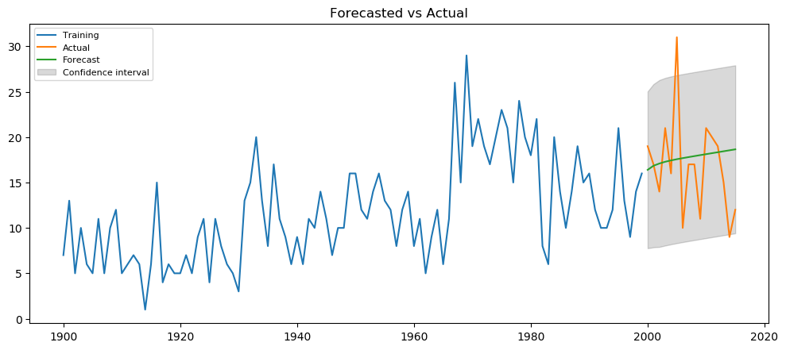
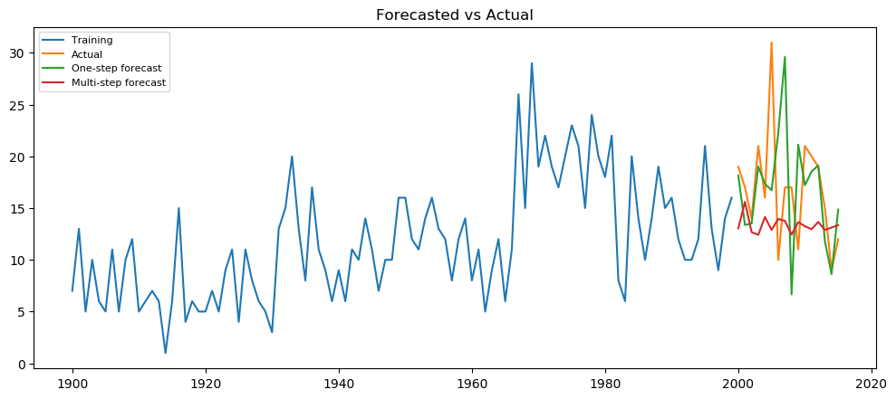
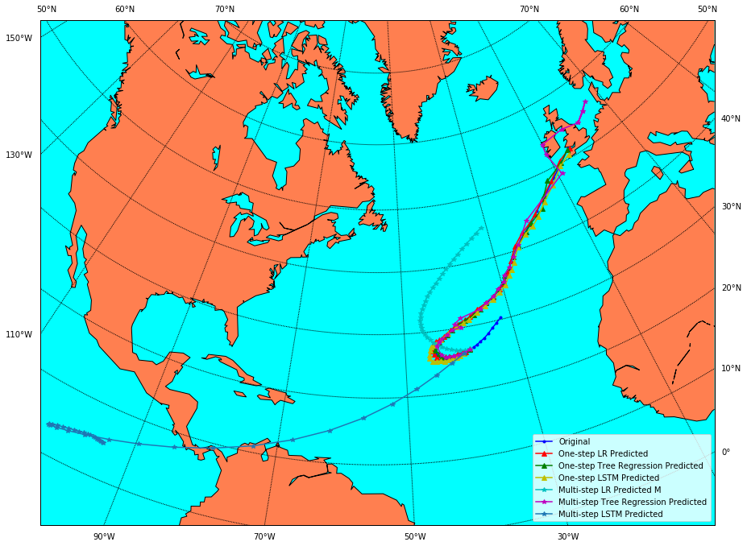
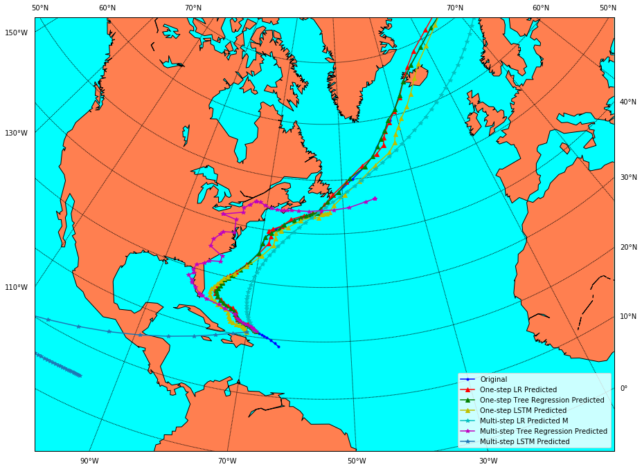
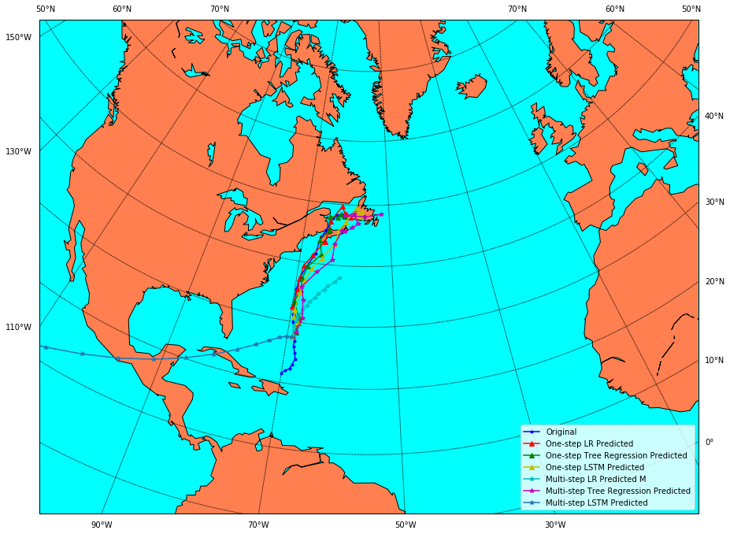

# 19W8561113 WS 2019-2020 - Data science and Big data - introduction and use cases

## Assignment for 2019-2020 Winter Semester - Prediction of Hurricanes in the Atlantic

**Submitted by:**
 * Boqin Cai 
 * Stephanie Tumampos

A corresponding summary report is also attached together with this notebook for workflow and results.

In this project, we have 2 main questions that are predicting annual number of hurricanes and priditcting the trajectory of the hurricane.

In this reposotory, the [DataScience.ipynb](https://github.com/solidjerryc/data-science-assignment-unisbg/blob/master/DataScience.ipynb) is the notebook of our codes and documentations. [preprocessed_dataset.zip](https://github.com/solidjerryc/data-science-assignment-unisbg/blob/master/preprocessed_dataset.zip) and [cm.h5](https://github.com/solidjerryc/data-science-assignment-unisbg/blob/master/cm.h5) are the preprocessed dataset and the pre-trained LSTM model file of question 2.  

The following 2 plots are the results of question 1, the prediction of annual number of hurricanes.

 ARIMA(2,2,1)

 RNN

The next 3 maps are the results of the trajectory prediction.

 The prediction of hurricane AL071906

 The prediction of hurricane AL041932

 The prediction of hurricane AL112008

